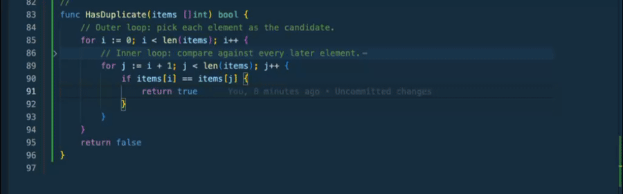
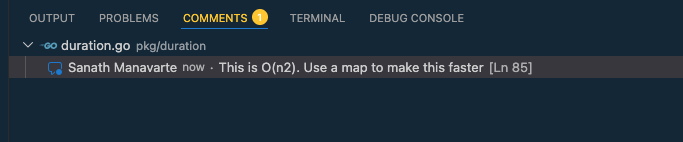
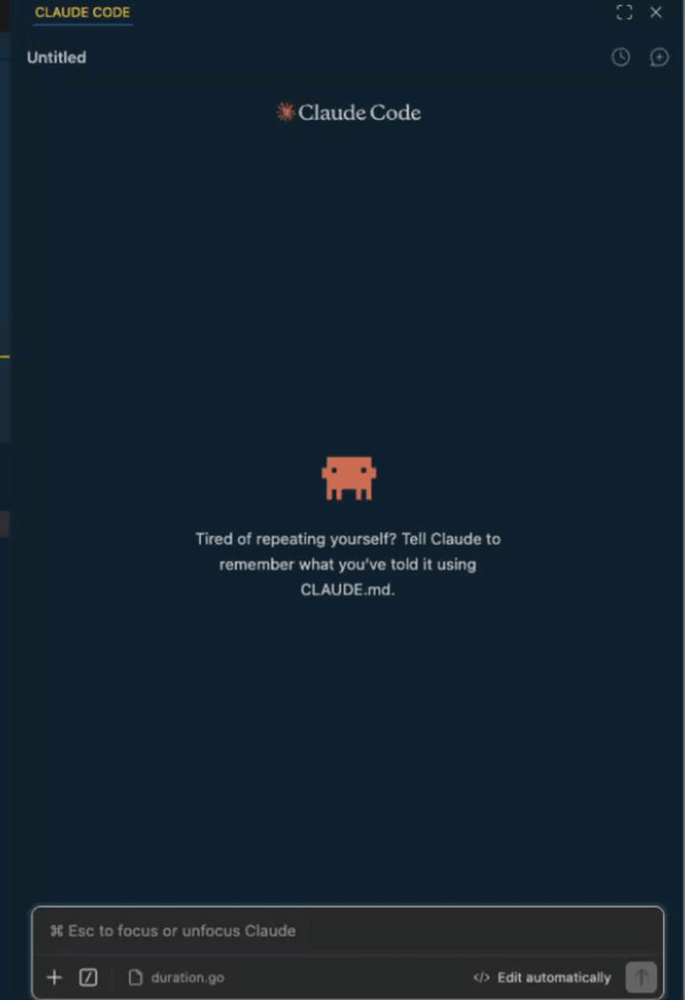
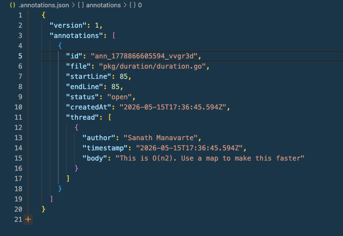

# Code Annotate

Telling an AI agent _"look at **this** — the function on line 42, not the whole file"_ is harder than it should be. Pasting line numbers into chat is brittle, screenshots don't compose, and there's no place for the agent to write back when it's done.

**Code Annotate** is GitHub-style review annotations for any file in VS Code. Select lines, leave a comment, reply, resolve. Everything lives in a plain `.annotations.json` at the workspace root, so **AI agents can read your comments, act on them, and reply** — the same way a teammate would on a PR.

---

## 1. Annotate any range of lines

Select the lines you want to comment on, hit `Cmd+Alt+A` (macOS) / `Ctrl+Alt+A` (Windows/Linux), and type. The thread opens inline right where your selection is — no popups, no jumping to the top of the file.

You can also click the `+` in the gutter to start an annotation on a single line, or right-click → _Add Annotation_.

## 2. Browse and reply, like a PR review

Every annotation in the workspace shows up in VS Code's built-in **Comments** panel. Click any entry to jump straight to the line; reply, resolve, or unresolve right from the thread.

## 3. Hand them off to an AI agent

Annotations live in plain JSON, so any AI agent can read them as part of its working context. Tell Claude Code (or Cursor, or anything else) "address the open annotations" and the agent picks up the conversation thread-by-thread.

Drop this into your `CLAUDE.md`, `.cursorrules`, or equivalent agent instructions to make it stick:

> If `.annotations.json` exists at the repo root, read it before starting work. Each entry has `file`, `startLine`, `endLine`, `status`, and a `thread` of comments. Treat `status: "open"` annotations as TODOs from the user. When you address one, either append a reply to its `thread` array or set its `status` to `"resolved"`.

## 4. The storage is just a JSON file

Everything you've annotated is in `.annotations.json` at the workspace root. Diffable, commit-friendly, and editable by hand or by an AI agent — the extension watches the file and re-renders threads when it changes externally.

Line numbers are 1-indexed and inclusive. The `author` defaults to your `git config user.name`.

## Commands

| Command                             | Default keybinding         |
| ----------------------------------- | -------------------------- |
| Code Annotate: Add Annotation       | `Cmd+Alt+A` / `Ctrl+Alt+A` |
| Code Annotate: Show All Annotations | —                          |

Reply / Resolve / Unresolve / Delete appear in the thread's title and reply bars. In the comment input, **Enter** submits and **Shift+Enter** inserts a newline.

## Caveats (v1)

- Annotations are anchored by line number. If you edit the file heavily, they may drift. A future version may add content-aware re-anchoring.
- One workspace folder is supported per session.

## License

MIT
